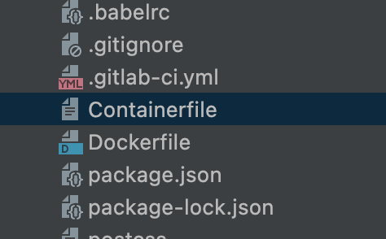

Application-Deployed-in-LightSail
=====

.. _problem-statement:

Problem-statement
------------

Build and Run the MB Application in LightSail.

Pre-Requisites
----------------

* MB Application Zip File.
* AWS Account with Free Tier Access .
* Chrome Browser for using lighthouse Extension.
* Demo Website to migrate http://www.mercedes-benz-versicherung.de
* Basic Knowledge of AWS
* IntelliJ or any Framework which support React
* Install Node Js, NPM & React js
* Home Brew
* Docker

Source Website Tech Stack
----------------

* JQuery.
* Google Maps.
* UserCentrics.

Migration Steps
----------------
#. Test local run of the application.
  * Unzip the MB application file and open it with Framework which you are using. 
  * install webpack using brew 
  * install babel using brew 
  * npm install --save-dev babel-loader @babel/core @babel/preset-env webpack 
  * npm run build 
  * npm install http-server -g 
  * npm start 
  * npx http-server  
  * You should see the application is started. 
  * You could see the below kind of links to access the application. 
  * Available on: 
    * http://127.0.0.1:9999.
    * http://10.0.0.4:9999.
#. In the MB application file change the version of PHP in Container.file from 7 to 8.

.. code-block:: console

RUN apk update && apk add php8-apache2 php8-curl && \ln -sfv /dev/stdout /var/log/apache2/access.log && \ln -sfv /dev/stderr /var/log/apache2/error.log
#. Build the docker Image and Push into ECR by using the below command. Create a copy of the Conatinerfile and Rename the Copy with “Dockerfile”.

 * aws ecr get-login-password --region us-east-1 | docker login --username AWS --password-stdin 845835842856.dkr.ecr.us-east-1.amazonaws.com.
 * docker buildx build --platform=linux/amd64 -t 845835842856.dkr.ecr.us-east-1.amazonaws.com/test:newimage .
 * docker push 845835842856.dkr.ecr.us-east-1.amazonaws.com/test:newimage.

Migration Outcome
----------------

Challenges
----------------

References
----------------
